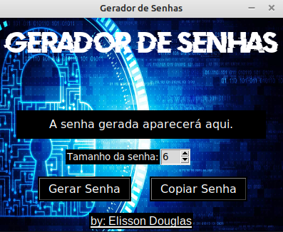
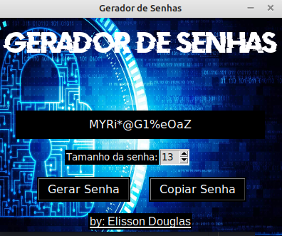

# 🔑 __GERADOR DE SENHAS__
***
## __Aplicativo Desktop de Gerador de Senhas utilizando Python__
***
### *Funcionalidades*
- Escolher tamanho da senha
    - Tamanhos de 6 até 32 caracteres
- Gerar senha aleatória
    - As senhas podem conter: letras maiúsculas e minúsculas, números e simbolos
- Copiar senha para a área de transferência
***
### 🖥️  *Tela do Aplicativo*

***
### 🛠️ *Tecnologia utilizada*
- Python 3.10
    - Biblioteca Tkinter para a criação da interface gráfica
    - Biblioteca random para gerar as senhas
***